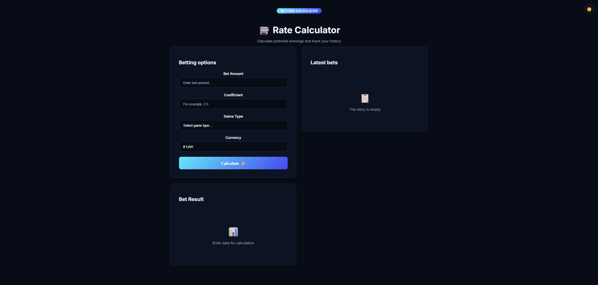
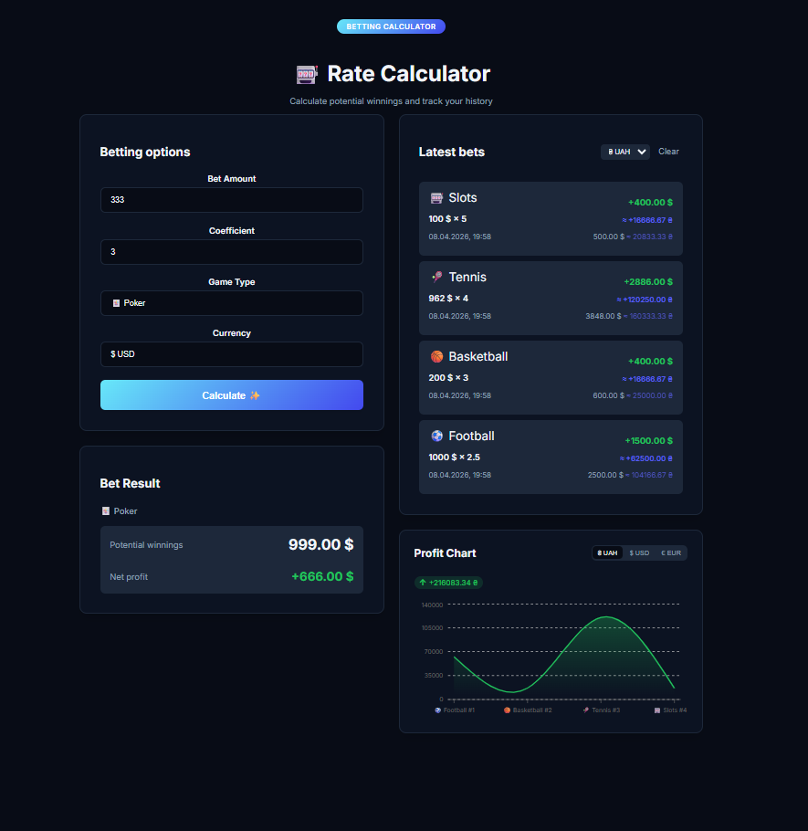

# 🎰 Betting Calculator

A convenient web application for calculating potential betting winnings.
It allows you to quickly calculate profit, saves calculation history,
and visualizes profit dynamics on a chart.

---

## ✨ Features

### 📝 Bet Calculation Form

- Input of **bet amount** (up to 100,000)
- Input of **odds** (from 1.01 to 1000)
- Selection of **game type**: ⚽ Football, 🏀 Basketball, 🎾 Tennis,
  🎰 Slots, 🃏 Poker, 🎲 Roulette
- Selection of **currency**: ₴ UAH, \$ USD, € EUR
- Validation of all fields with error messages

### 📊 Calculation Result

- Display of **potential winnings** and **net profit**
- Instant recalculation when parameters change

### 📋 Bet History

- Storage of the **last 5 calculations**
- Data is stored in **localStorage** (persists after page reload)
- Currency conversion in the history list
- Ability to **clear** history

### 📈 Profit Chart

- Visualization of profit dynamics using an **Area Chart**
- Built-in **currency switcher** (UAH / USD / EUR) with automatic
  conversion
- Display of total amount and growth

### 🌗 Dark / Light Theme

- Theme switcher in the top right corner
- Theme preference is saved between sessions

---

## 🛠 Technologies

Technology Purpose

---

**React 18** UI framework
**TypeScript** Typing
**Vite 5** Build tool & dev server
**Tailwind CSS** Styling
**CSS Modules** Scoped component styles
**Recharts** Charts
**React Router** Routing
**Vitest** Testing

---

## 📁 Project Structure

    src/
    ├── components/
    │   ├── BetForm.tsx
    │   ├── BetResult.tsx
    │   ├── BetHistory.tsx
    │   ├── BetHistoryItem.tsx
    │   ├── ProfitChart.tsx
    │   └── ThemeToggle.tsx
    ├── constants/
    │   ├── currencies.ts
    │   └── gameTypes.ts
    ├── hooks/
    │   └── useBetCalculator.ts
    ├── pages/
    │   └── Index.tsx
    └── test/
        └── betCalculator.test.ts

---

## 🚀 Run

    npm install
    npm run dev
    npm run test
    npm run build

---

## 📄 License

MIT
